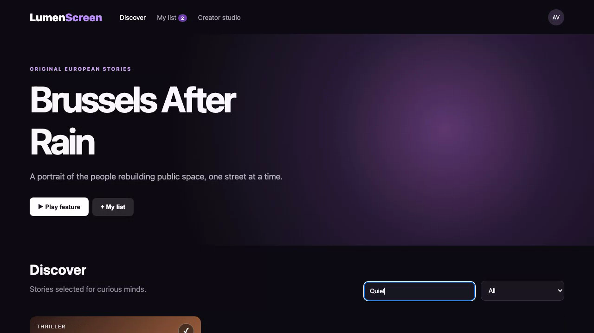

# Lumen Screen

Lumen Screen is a video-streaming service for discovering and watching original European stories.

## Live demo

[Watch the recorded product demonstration](docs/demo.webm)

This recording shows the real product running and demonstrates its main screens and actions.

## Screenshots



## Main features

- Browse films, series, and documentaries.
- Search and filter programmes.
- Save programmes to a personal list.
- Continue programmes already started.
- Create a draft for a new programme.
- Review programmes waiting to be published.

## Technology used

- Vue 3 with TypeScript.
- Vite for local development and production builds.
- Java with Spring Boot for the backend.
- Maven for Java builds.
- Vitest and JUnit for automated checks.

## Installation instructions

You need Node.js 20 or newer, Java 21 or newer, and Maven 3.9 or newer.

Install the frontend packages:

```bash
npm ci
```

Run all automated checks and production builds:

```bash
npm test
npm run build
npm run backend:test
npm run backend:build
```

Start the frontend and Java backend together:

```bash
npm run fullstack
```

Open [http://localhost:5173](http://localhost:5173) for the product. The Java API runs at [http://localhost:8080](http://localhost:8080).

## Commercial licensing/contact

No commercial license is granted automatically. For commercial licensing, integration work, consulting, or partnership enquiries, contact [Amitesh2022 through GitHub](https://github.com/Amitesh2022).

## Business problem and users

Lumen Screen is a video-streaming service for discovering and watching original European stories. It is useful for viewers and for editorial teams preparing new programmes.

## Key workflows

- Browse films, series, and documentaries.
- Search and filter programmes.
- Save programmes to a personal list.
- Continue programmes already started.
- Create a draft for a new programme.
- Review programmes waiting to be published.

## Vue highlights

The product uses Vue to organise separate pages, forms, lists, and smooth screen changes. Shared information stays in one place so every page shows the same result. Automated checks cover the most important actions.

## Java backend highlights

The Java backend uses Spring Boot. It provides real API endpoints to list, search, and create programme task records. It checks incoming information, returns clear errors, exposes a health check, and includes automated Java tests.

## Architecture and state flow

The browser application calls the Java API on port 8080. The Java service checks the request and keeps the shared product information. After a user creates a record, the API returns the saved result and the browser refreshes the list.

## Accessibility and responsive behaviour

Buttons, forms, and links can be used with a keyboard. Labels explain what each field does, and important information is shown with words, not only colours. The layout also adjusts for tablets and phones.
